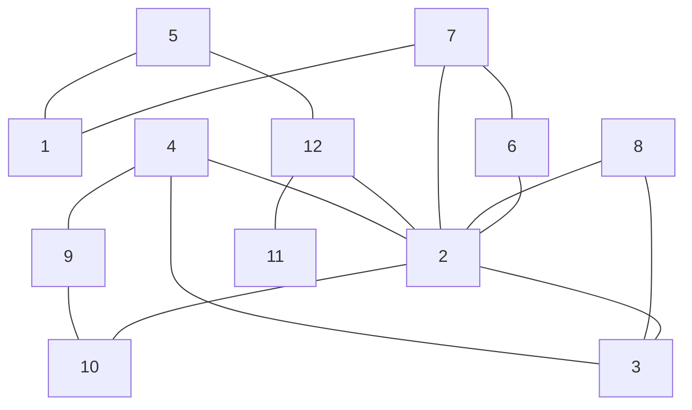

# Graph

Raku package for (discrete mathematics) graph data structures and algorithms.

**Remark:** This package is *not* for drawing and rendering images. 
It is for the abstract data structure [***graph***](https://en.wikipedia.org/wiki/Graph_(discrete_mathematics)). 

------

## Installation

From Zef ecosystem:

```
zef install Graph
```

From GitHub:

```
zef install https://github.com/antononcube/Raku-Graph.git
```

-------

## Design and implementation details

### Motivation

- Needless to say, Graph theory is huge.
  - But certain algorithms like path and cycle finding are relatively easy to implement
    and are fundamental both mathematics-wise and computer-science-wise.
- Having fast shortest path finding algorithms in graphs should be quite a booster for geography related projects.

### Design

- The central entity is the `Graph` class.
- `Graph` is as generic as possible.
  - Meaning it is directed graphs.
  - Undirected graphs are represented as directed graphs.
    - I.e. with twice as many edges than necessary.
  - The current graph representation is with hash-of-hashes, (`adjacency-list`), that keeps from-to-weight relationships.
    - For example, `$g.adjacency-list<1><2>` gives the weight of the edge connecting vertex "1" to vertex "2".
  - The vertexes are only strings.
    - Not a "strong" design decision.
    - More general vertexes can be imitated (in the future) with vertex tags.
      - This is related to having (in Raku) sparse matrices with named rows and columns. 
- Since I know Mathematica / Wolfram Language (WL) very well, many of the method names and signatures are
  strongly influenced by the corresponding functions in WL.
  - I do not follow them too strictly, though.
  - One reason is that with Raku it is much easier to have and use named arguments than with WL.


### Implementation

- I was considering re-programming Perl5’s "Graph", [JHp1], into Raku, but it turned out it was easier to write the algorithms directly in Raku.
  - (To me at least...)
- The classes creating special graphs, like, grid-graph, star-graph, etc., are sub-classes of `Graph` 
   with files in the sub-directory "Graph".
  - See usage of such classes [here](./examples/Named-graphs.raku).

### Visualization

- Visualizing the graphs (the objects of the class `Graph`) is very important.
  - Has to be done from the very beginning of the development.
    - (Again, for me at least...)
- The class `Graph` has the methods `wl` and `mermaid` for representing the graphs for Wolfram Language (WL) and mermaid-js respectively.
- Mermaid's graph nodes and edges arrangement algorithm can produces "unexpected" images for the standard, named graphs.
  - Like, "grid graph", "cycle graph", etc.

### Performance

- So far, I have tested the path finding algorithms on "Graph" on small graphs and moderate size graphs.
  - The largest random graph I used had 1000 vertexes and 1000 edges.
  - Mathematica (aka Wolfram Language) can be 500 ÷ 10,000 faster.
  - I hope good heuristic functions for the "A* search" method would make `find-shortest-path` fast enough,
    for say country / continent route systems.
    - With the larger, 1,000-vertex random graphs finding paths with the method "a-star" is ≈50 faster than with the method "dijkstra". 
      - See [here](./examples/Performance.raku).
- Setting up comprehensive performance profiling and correctness testing is some involved.
  - One main impediment is that in Raku one cannot expect and specify same random numbers between different sessions. 

------

## Usage examples

Here we create a dataset of edges:

```perl6
my @edges =
        { from => '1', to => '5', weight => 1 },
        { from => '1', to => '7', weight => 1 },
        { from => '2', to => '3', weight => 1 },
        { from => '2', to => '4', weight => 1 },
        { from => '2', to => '6', weight => 1 },
        { from => '2', to => '7', weight => 1 },
        { from => '2', to => '8', weight => 1 },
        { from => '2', to => '10', weight => 1 },
        { from => '2', to => '12', weight => 1 },
        { from => '3', to => '4', weight => 1 },
        { from => '3', to => '8', weight => 1 },
        { from => '4', to => '9', weight => 1 },
        { from => '5', to => '12', weight => 1 },
        { from => '6', to => '7', weight => 1 },
        { from => '9', to => '10', weight => 1 },
        { from => '11', to => '12', weight => 1 };

@edges.elems;
```
```
# 16
```

**Remark:** If there is no `weight` key in the edge records the weight of the edge is taken to be 1.

Here we create a graph object with the edges dataset:

```perl6
use Graph;

my $graph = Graph.new;
$graph.add-edges(@edges);
```
```
# Graph(vertexes => 12, edges => 16, directed => False)
```

Here are basic properties of the graph:

```perl6
say 'edge count   : ', $graph.edge-count;
say 'vertex count : ', $graph.vertex-count;
say 'vertex list  : ', $graph.vertex-list;
```
```
# edge count   : 16
# vertex count : 12
# vertex list  : (1 10 11 12 2 3 4 5 6 7 8 9)
```

Here we display the graph using [Mermaid-JS](https://mermaid.js.org), (see also, [AAp1]):

```perl6, output.lang=mermaid, output.prompt=NONE
$graph.mermaid(d=>'TD')
```


Here we find the shortest path between nodes "1" and "4":

```perl6
say 'find-shortest-path : ', $graph.find-shortest-path('1', '4');
```
```
# find-shortest-path : [1 7 2 4]
```

Here we find all paths between "1" and "4", (and sort them by length and vertex names.):

```perl6
say 'find-path : ' , $graph.find-path('1', '4', count => Inf).sort({ $_.elems ~ ' ' ~ $_.join(' ') });
```
```
# find-path : ([1 7 2 4] [1 5 12 2 4] [1 7 2 3 4] [1 7 6 2 4] [1 5 12 2 3 4] [1 7 2 10 9 4] [1 7 2 8 3 4] [1 7 6 2 3 4] [1 5 12 2 10 9 4] [1 5 12 2 8 3 4] [1 7 6 2 10 9 4] [1 7 6 2 8 3 4])
```

Here we find a [Hamiltonian path](https://en.wikipedia.org/wiki/Hamiltonian_path) in the graph:

```perl6
say 'find-hamiltonian-path : ' , $graph.find-hamiltonian-path();
```
```
# find-hamiltonian-path : [8 3 4 9 10 2 6 7 1 5 12 11]
```

Here we find a cycle:

```perl6
say 'find-cycle : ' , $graph.find-cycle().sort({ $_.elems ~ ' ' ~ $_.join(' ') });
```
```
# find-cycle : ([2 6 7 2])
```

Here we find all cycles in the graph:

```perl6
say 'find-cycle (all): ' , $graph.find-cycle(count => Inf).sort({ $_.elems ~ ' ' ~ $_.join(' ') });
```
```
# find-cycle (all): ([2 3 4 2] [2 3 8 2] [2 6 7 2] [10 2 4 9 10] [2 4 3 8 2] [1 5 12 2 7 1] [10 2 3 4 9 10] [1 5 12 2 6 7 1] [10 2 8 3 4 9 10])
```

-------

## TODO

### Main, core features

- [ ] TODO Object methods
  - [X] DONE Str and gist methods
  - [ ] TODO Deep copy
  - [ ] TODO Undirected deep copy
  - [ ] TODO Make undirected
  - [ ] TODO Ingest vertexes and edges of another `Graph` object
  - [ ] TODO Comparison: `eqv` and `ne`.
- [ ] TODO Disjoint graphs
  - The graphs can be disjoint as long as the components have edges.
  - I.e. the class `Graph` does not support "lone vertices."
- [ ] TODO Vertexes
  - [X] DONE Vertex list
  - [X] DONE Vertex count
  - [X] DONE Vertex degree
  - [X] DONE in-degree, edges-at
  - [X] DONE out-degree, edges-from
  - [ ] TODO Vertex tags support
  - [ ] TODO Add vertex
  - [ ] TODO Has vertex
  - [ ] TODO Delete vertex(es)
- [ ] TODO Edges
  - [X] DONE Edge list
  - [X] DONE Edge dataset
  - [X] DONE Edge count
  - [ ] TODO Edge tags support
  - [ ] TODO Add edge
  - [ ] TODO Has edge
  - [ ] TODO Delete edge(s)
- [ ] TODO Matrix representation
  - Sparse matrices are needed before "seriously" considering this.
  - Sparse matrices should be easy to create using the (already implemented) edge dataset.
          
### Paths, cycles, flows

- [X] DONE Shortest paths
  - [X] DONE Find shortest path
  - [X] DONE Find Hamiltonian paths
    - For both the whole graph or for a given pair of vertexes.
- [ ] TODO Flows
  - [ ] TODO Find maximum flow
  - [ ] TODO Find minimum cost flow
- [ ] TODO Distances
  - [X] DONE Graph distance
    - See shortest path.
  - [ ] TODO Graph distance matrix
    - Again, requires choosing a matrix Raku class or package. 
- [X] DONE Longest shortest paths
  - [X] DONE Vertex eccentricity
  - [X] DONE Graph radius
  - [X] DONE Graph diameter
  - [X] DONE Graph center
  - [X] DONE Graph periphery
- [ ] TODO Topological paths
  - [ ] TODO Topological sort
- [ ] TODO Cycles and tours
  - [X] DONE Find cycle
    - [X] Just one cycle
    - [X] All cycles
  - [ ] TODO Find shortest tour
  - [ ] TODO Find postman tour
  - [ ] TODO Find Eulerian cycle
  - [ ] TODO Find Hamiltonian cycle
  - [ ] TODO Find cycle matrix
- [ ] TODO Independent paths
  - [X] DONE Find paths
  - [ ] TODO Find edge independent paths
  - [ ] TODO Find edge vertex paths

### Operations

- [ ] TODO Unary graph operations
  - [X] TODO Reversed graph
  - [X] TODO Complement graph
  - [ ] TODO Edge contraction
  - [ ] TODO Line graph
  - [ ] TODO Dual graph
- [ ] TODO Binary graph operations
  - [ ] TODO Disjoint union of graphs
  - [ ] TODO Cartesian product of graphs
  - [ ] TODO Tensor product of graphs
  - [ ] TODO Strong product of graphs
  - [ ] TODO Lexicographic product of graphs

### Construction

- [X] DONE Construction of (regular) graphs
  - [X] DONE [Complete graphs](https://en.wikipedia.org/wiki/Complete_graph)
  - [X] DONE [Cycle graphs](https://en.wikipedia.org/wiki/Cycle_graph)
  - [X] DONE [Hypercube graphs](https://en.wikipedia.org/wiki/Hypercube_graph)
  - [X] DONE [Grid graphs](https://en.wikipedia.org/wiki/Lattice_graph)
  - [X] DONE [Knight tour graphs](https://en.wikipedia.org/wiki/Knight%27s_graph)
  - [X] DONE [Star graphs](https://en.wikipedia.org/wiki/Star_graph)
  - [X] DONE Path graphs
  - [X] DONE [Wheel graphs](https://en.wikipedia.org/wiki/Wheel_graph)
- [X] DONE Construction of random graphs
  - Since different kinds of vertex-edge distributions exists, separate distributions objects are used.
    - See `Graph::Distribution`.
  - [X] DONE [Barabasi-Albert distribution](https://en.wikipedia.org/wiki/Barabási–Albert_model) 
  - [X] DONE Bernoulli distribution 
  - [X] DONE [de Solla Price's model distribution](https://en.wikipedia.org/wiki/Price%27s_model) 
  - [X] DONE "Simple" random `(m, n)` graphs with m-vertexes and n-edges between them
    - This was the first version of `Graph::Random`.
    - Refactored to be done via the uniform graph distribution.
  - [X] DONE [Watts–Strogatz model distribution](https://en.wikipedia.org/wiki/Watts–Strogatz_model) 
  - [X] DONE Uniform distribution
- [ ] TODO Construction of *individual* graphs
  - [ ] TODO Bull graph
  - [ ] TODO Butterfly graph
  - [ ] TODO Chavatal graph
  - [ ] TODO Diamond graph
  - [ ] TODO Durer graph
  - [ ] TODO Franklin graph
  - [X] DONE [Petersen graph](https://en.wikipedia.org/wiki/Petersen_graph)
  - [ ] TODO Wagner graph

### Tests

- [ ] TODO Unit tests
  - [X] DONE Sanity
  - [X] DONE Undirected graphs
  - [ ] TODO Directed graphs cycles
- [ ] TODO Cross-verification with Mathematica
  - [X] DONE General workflow programming/setup
  - [ ] TODO Path finding
  - [ ] TODO Cycle finding

### Documentation

- [X] DONE Basic usage over undirected graphs
- [ ] TODO Basic usage over directed graphs
- [X] DONE Regular graphs creation (Grid, Wheel, etc.)
  - [Notebook with a gallery of graphs](./docs/Named-graphs-gallery.ipynb)
- [ ] TODO Random graphs creation

-------

## References

### Articles

[Wk1] Wikipedia entry, ["Graph (discrete mathematics)"](https://en.wikipedia.org/wiki/Graph_(discrete_mathematics)).

[Wk2] Wikipedia entry, ["Graph theory"](https://en.wikipedia.org/wiki/Graph_theory).

[Wk3] Wikipedia entry, ["Glossary of graph theory"](https://en.wikipedia.org/wiki/Glossary_of_graph_theory).

[Wk4] Wikipedia entry, ["List of graphs"](https://en.wikipedia.org/wiki/List_of_graphs) (aka "Gallery of named graphs.")

[Wk5] Wikipedia entry, ["Hamiltonian path"](https://en.wikipedia.org/wiki/Hamiltonian_path).

### Packages

[AAp1] Anton Antonov,
[WWW::MermaidInk Raku package](https://github.com/antononcube/Raku-WWW-MermaidInk),
(2023),
[GitHub/antononcube](https://github.com/antononcube).

[AAp2] Anton Antonov,
[Proc::ZMQed Raku package](https://github.com/antononcube/Raku-Proc-ZMQed),
(2022),
[GitHub/antononcube](https://github.com/antononcube).

[JHp1] Jarkko Hietaniemi,
[Graph Perl package](https://metacpan.org/dist/Graph/view/lib/Graph.pod),
(1998-2014),
[MetaCPAN](https://metacpan.org).
