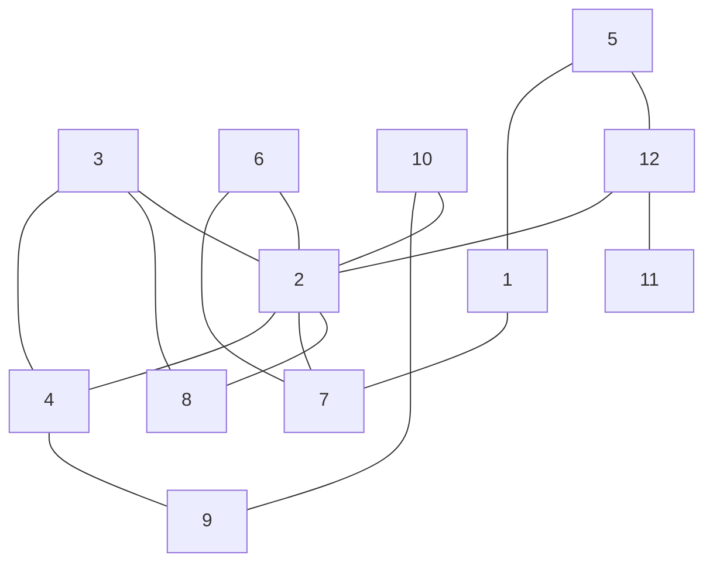

# Graph

Raku package for (discrete mathematics) graph data structures and algorithms.

------

## Installation

From Zef ecosystem:

```
zef install Graph
```

From GitHub:

```
zef install https://github.com/antononcube/Raku-Graph.git
```

------

## Usage examples

Here create a dataset of edges:

```perl6
my @edges =
        { from => '1', to => '5', weight => 1 },
        { from => '1', to => '7', weight => 1 },
        { from => '2', to => '3', weight => 1 },
        { from => '2', to => '4', weight => 1 },
        { from => '2', to => '6', weight => 1 },
        { from => '2', to => '7', weight => 1 },
        { from => '2', to => '8', weight => 1 },
        { from => '2', to => '10', weight => 1 },
        { from => '2', to => '12', weight => 1 },
        { from => '3', to => '4', weight => 1 },
        { from => '3', to => '8', weight => 1 },
        { from => '4', to => '9', weight => 1 },
        { from => '5', to => '12', weight => 1 },
        { from => '6', to => '7', weight => 1 },
        { from => '9', to => '10', weight => 1 },
        { from => '11', to => '12', weight => 1 };

@edges.elems;
```
```
# 16
```

**Remark:** If there is no `weight` key in the edge records the weight of the edge is taken to be 1.

Here we create a graph object with the edges dataset:

```perl6
use Graph;

my $graph = Graph.new;
$graph.add-edges(@edges);
```
```
# Graph(vertexes => 12, edges => 16, directed => False)
```

Here are basic properties of the graph:

```perl6
say 'edge count   : ', $graph.edge-count;
say 'vertex count : ', $graph.vertex-count;
say 'vertex list  : ', $graph.vertex-list;
```
```
# edge count   : 16
# vertex count : 12
# vertex list  : (1 10 11 12 2 3 4 5 6 7 8 9)
```

Here we display the graph using [Mermaid-JS](https://mermaid.js.org), (see also, [AAp1]):

```perl6, output.lang=mermaid, output.prompt=NONE
$graph.mermaid(d=>'TD')
```


Here we find the shortest path between nodes "1" and "4":

```perl6
say 'find-shortest-path : ', $graph.find-shortest-path('1', '4');
```
```
# find-shortest-path : [1 7 2 4]
```

Here we find all paths between "1" and "4", (and sort them by length and vertex names.):

```perl6
say 'find-path : ' , $graph.find-path('1', '4', count => Inf).sort({ $_.elems ~ ' ' ~ $_.join(' ') });
```
```
# find-path : ([1 7 2 4] [1 5 12 2 4] [1 7 2 3 4] [1 7 6 2 4] [1 5 12 2 3 4] [1 7 2 10 9 4] [1 7 2 8 3 4] [1 7 6 2 3 4] [1 5 12 2 10 9 4] [1 5 12 2 8 3 4] [1 7 6 2 10 9 4] [1 7 6 2 8 3 4])
```

Here we find a [Hamiltonian path](https://en.wikipedia.org/wiki/Hamiltonian_path) in the graph:

```perl6
say 'find-hamiltonian-path : ' , $graph.find-hamiltonian-path();
```
```
# find-hamiltonian-path : [10 9 4 3 8 2 6 7 1 5 12 11]
```

Here we find a cycle:

```perl6
say 'find-cycle : ' , $graph.find-cycle().sort({ $_.elems ~ ' ' ~ $_.join(' ') });
```
```
# find-cycle : ([10 2 4 9 10])
```

Here we find all cycles in the graph:

```perl6
say 'find-cycle (all): ' , $graph.find-cycle(count => Inf).sort({ $_.elems ~ ' ' ~ $_.join(' ') });
```
```
# find-cycle (all): ([2 3 4 2] [2 3 8 2] [2 6 7 2] [10 2 4 9 10] [2 4 3 8 2] [1 5 12 2 7 1] [10 2 3 4 9 10] [1 5 12 2 6 7 1] [10 2 8 3 4 9 10])
```


-------

## TODO

### TODO Paths, cycles, flows

- [X] DONE Shortest paths
  - [X] DONE Find shortest path
  - [X] DONE Find Hamiltonian paths
- [ ] TODO Flows
  - [ ] TODO Find maximum flow
  - [ ] TODO Find minimum cost flow
- [ ] TODO Distances
  - [ ] TODO Graph distance
  - [ ] TODO Graph distance matrix
- [ ] TODO Longest shortest paths
  - [ ] TODO Vertex eccentricity
  - [ ] TODO Graph radius
  - [ ] TODO Graph diameter
  - [ ] TODO Graph center
  - [ ] TODO Graph periphery
- [ ] TODO Topological paths
  - [ ] TODO Topological sort
- [ ] TODO Cycles and tours
  - [ ] TODO Find shortest tour
  - [ ] TODO Find postman tour
  - [ ] TODO Find Eulerian cycle
  - [ ] TODO Find Hamiltonian cycle
  - [ ] TODO Find cycle
  - [ ] TODO Find cycle matrix
- [ ] TODO Independent paths
  - [X] DONE Find paths
  - [ ] TODO Find edge independent paths
  - [ ] TODO Find edge vertex paths

### Operations

- [ ] TODO Unary graph operations
  - [ ] TODO Edge contraction
  - [ ] TODO Line graph
  - [ ] TODO Dual graph
  - [ ] TODO Complement graph
- [ ] TODO Binary graph operations
  - [ ] TODO Disjoint union of graphs
  - [ ] TODO Cartesian product of graphs
  - [ ] TODO Tensor product of graphs
  - [ ] TODO Strong product of graphs
  - [ ] TODO Lexicographic product of graphs

### Construction

- [ ] TODO Construction of (regular) graphs
  - [ ] TODO Complete graphs
  - [ ] TODO Cycle graphs
  - [ ] TODO Star graphs
  - [ ] TODO Wheel graphs
- [ ] TODO Construction of random graphs
  - Potentially very complicated, since different kinds of vertex-edge distributions exists.
  - [ ] TODO "Simple" random `(m, n)` graphs with m-vertexes and n-edges between them 
- [ ] TODO Construction of *individual* graphs
  - [ ] TODO Bull graph
  - [ ] TODO Butterfly graph
  - [ ] TODO Chavatal graph
  - [ ] TODO Diamond graph
  - [ ] TODO Durer graph
  - [ ] TODO Franklin graph
  - [ ] TODO [Petersen graph](https://en.wikipedia.org/wiki/Petersen_graph)
  - [ ] TODO Wagner graph

### Tests

- [ ] TODO Unit tests
  - [ ] TODO Sanity
  - [ ] TODO Undirected graphs
  - [ ] TODO Directed graphs cycles
- [ ] TODO Cross-verification with Mathematica
  - [ ] TODO General workflow programming/setup
  - [ ] TODO Path finding
  - [ ] TODO Cycle finding

### Documentation

- [X] DONE Basic usage over undirected graphs
- [ ] TODO Basic usage over directed graphs

-------

## References

### Articles

[Wk1] Wikipedia entry, ["Graph (discrete mathematics)"](https://en.wikipedia.org/wiki/Graph_(discrete_mathematics)).

[Wk2] Wikipedia entry, ["Graph theory"](https://en.wikipedia.org/wiki/Graph_theory).

[Wk3] Wikipedia entry, ["Glossary of graph theory"](https://en.wikipedia.org/wiki/Glossary_of_graph_theory).

[Wk4] Wikipedia entry, ["List of graphs"](https://en.wikipedia.org/wiki/List_of_graphs) (aka "Gallery of named graphs.")

[Wk5] Wikipedia entry, ["Hamiltonian path"](https://en.wikipedia.org/wiki/Hamiltonian_path).

### Packages

[AAp1] Anton Antonov,
[WWW::MermaidInk Raku package](https://github.com/antononcube/Raku-WWW-MermaidInk),
(2023),
[GitHub/antononcube](https://github.com/antononcube).

[AAp2] Anton Antonov,
[Proc::ZMQed Raku package](https://github.com/antononcube/Raku-Proc-ZMQed),
(2022),
[GitHub/antononcube](https://github.com/antononcube).

